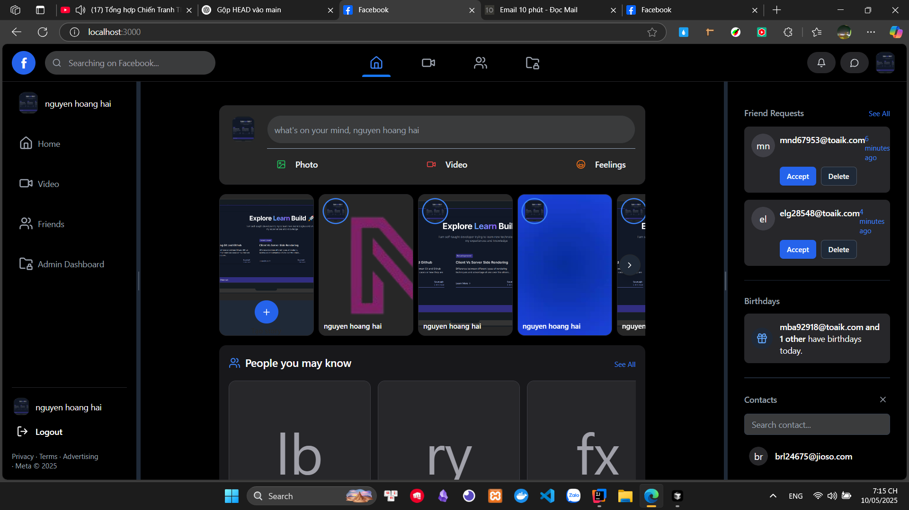
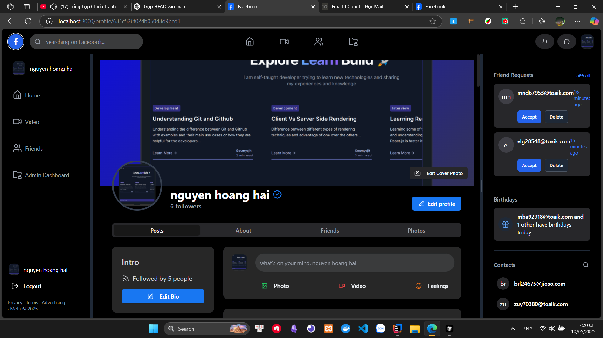
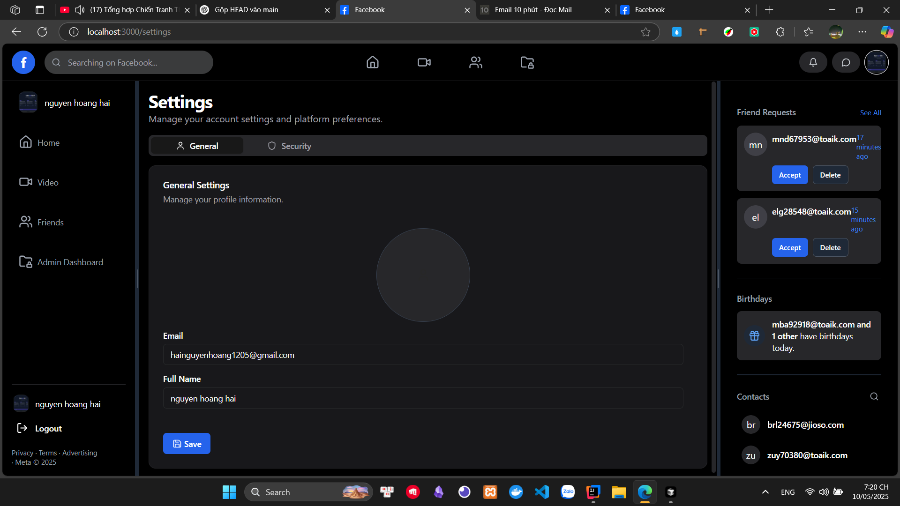
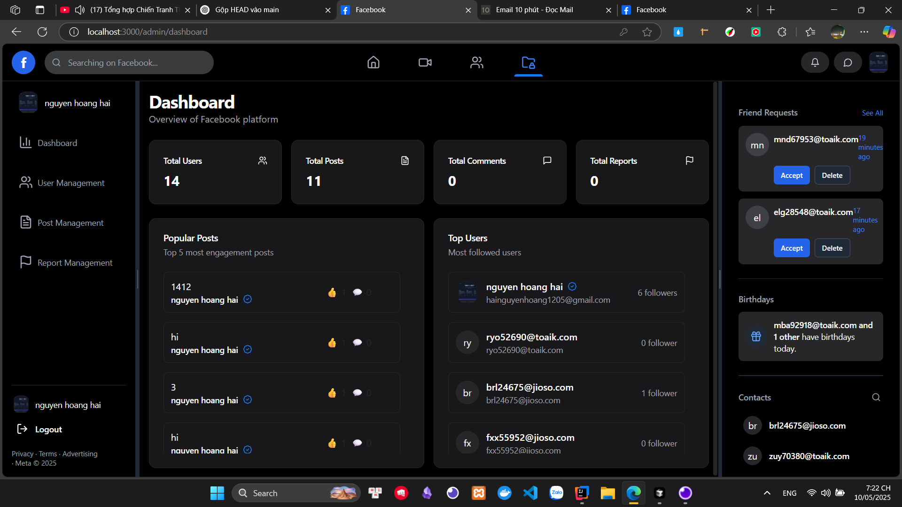
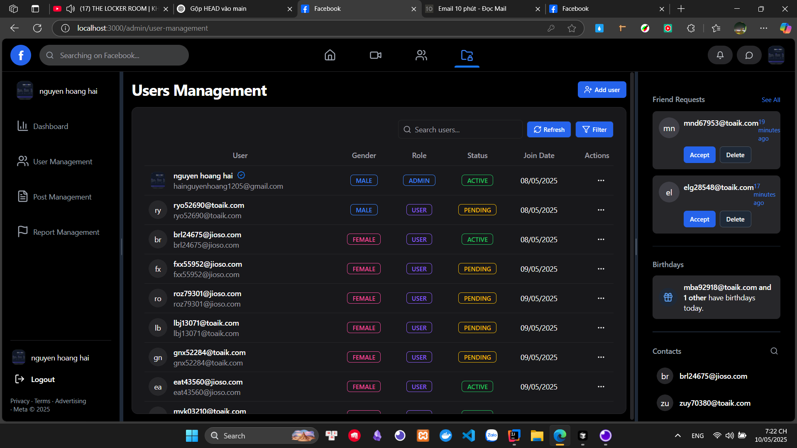
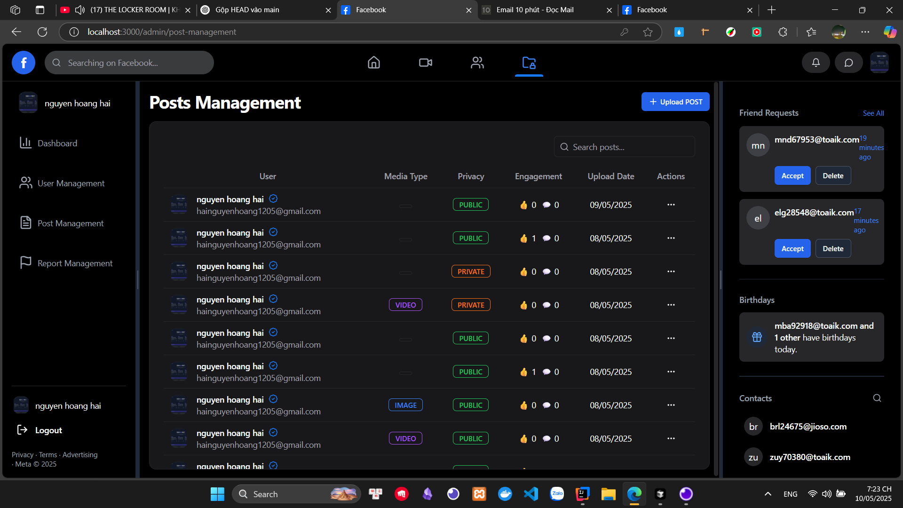
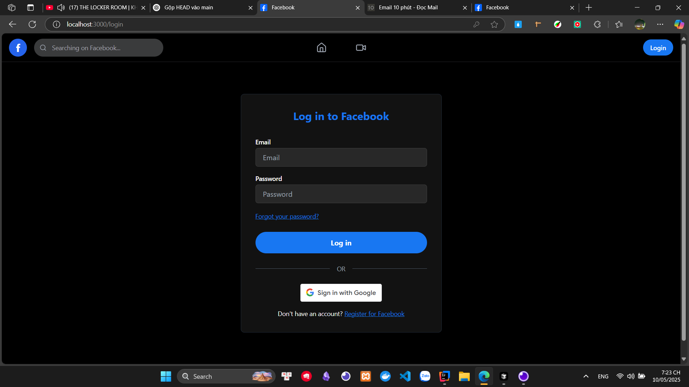
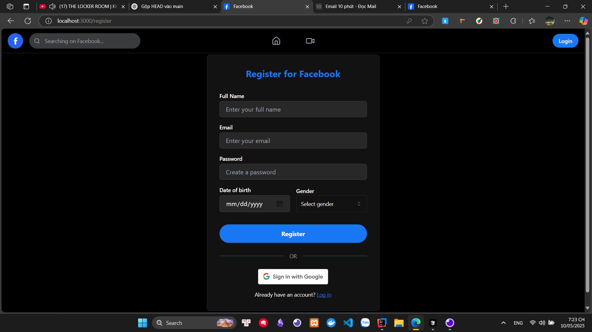
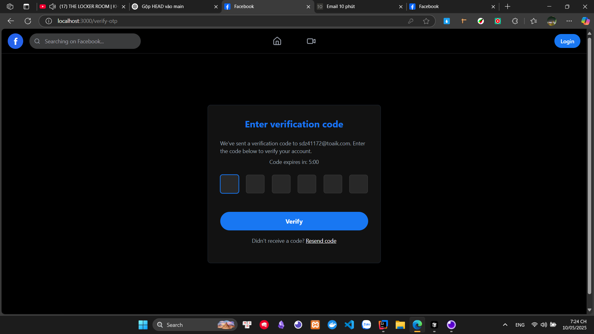
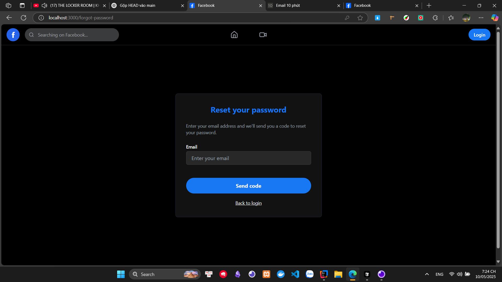

# Facebook Clone

## Overview

**Facebook Clone** is a full-featured social networking web application inspired by Facebook. It supports features like posting statuses, stories, user and post management, and more.

## Setup Steps

1. Clone the repository and navigate to the project directory:
```bash
git clone https://github.com/Hai1205/Facebook.git
```

2. Config Client and Server

## Artwork

### Home Page



### Profile Page



### Settings Page



### Admin Dashboard Page



### User Management Page



### Post Management Page



### Login Page


### Register Page



### Verify Page



### Reset Password Page



## License

This project is licensed under the MIT License. See the [LICENSE](LICENSE) file for details.

---

**Author:** [Hai1205](https://github.com/hai1205)